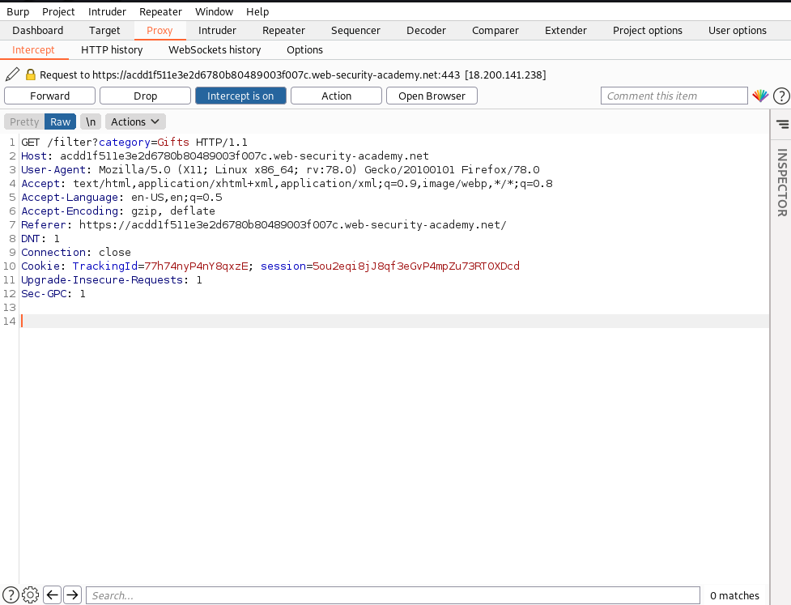
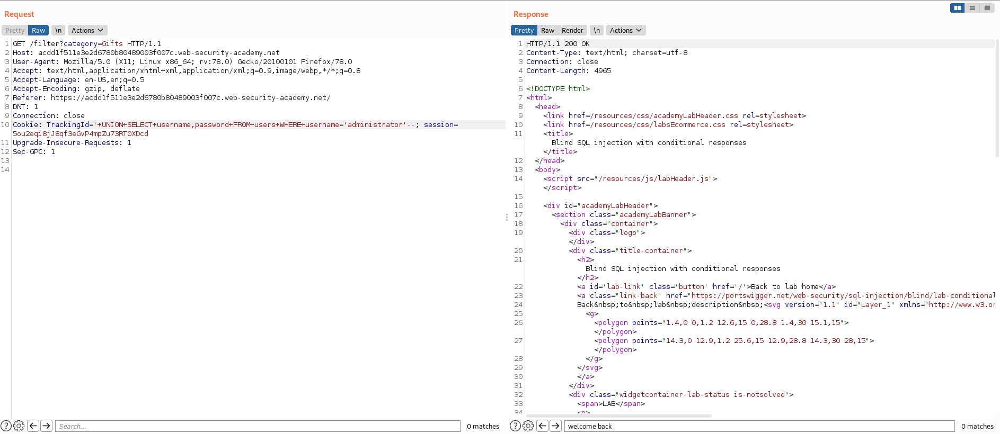
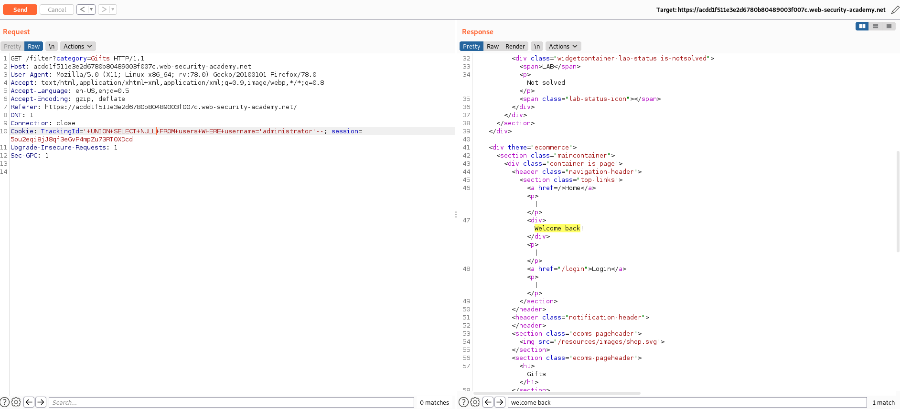
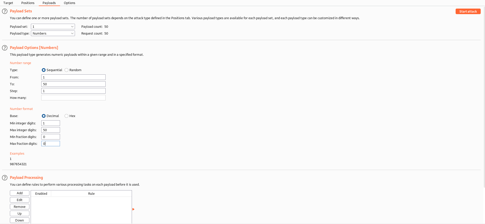
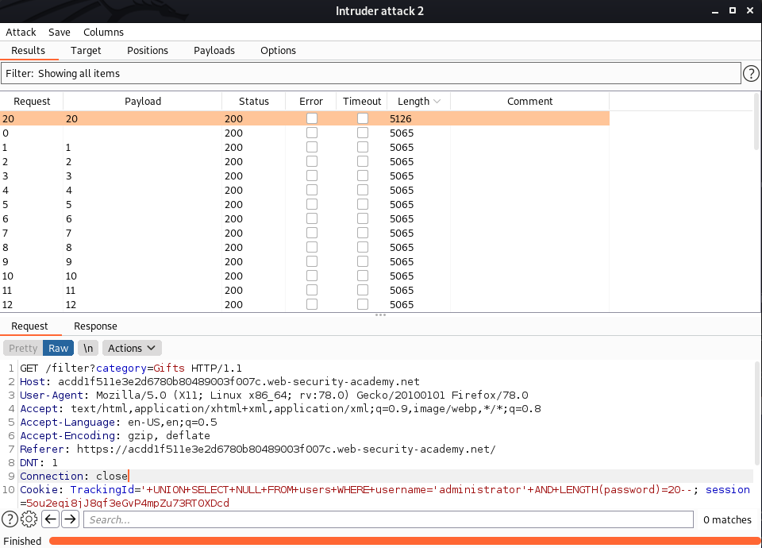
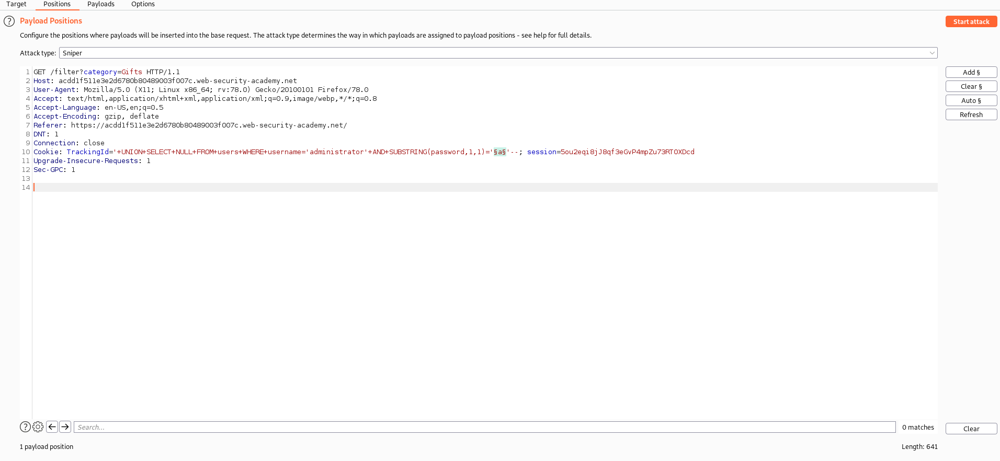
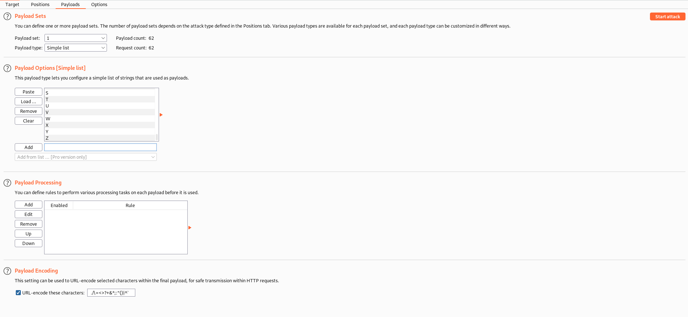
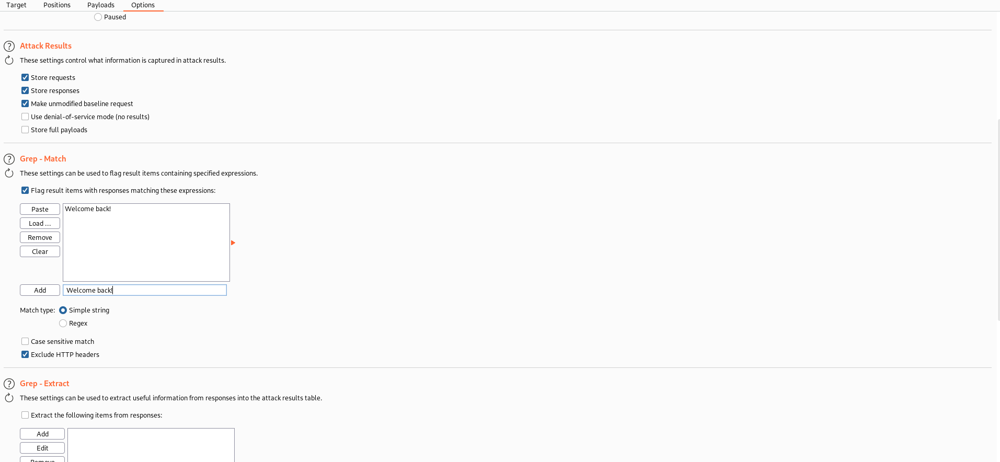
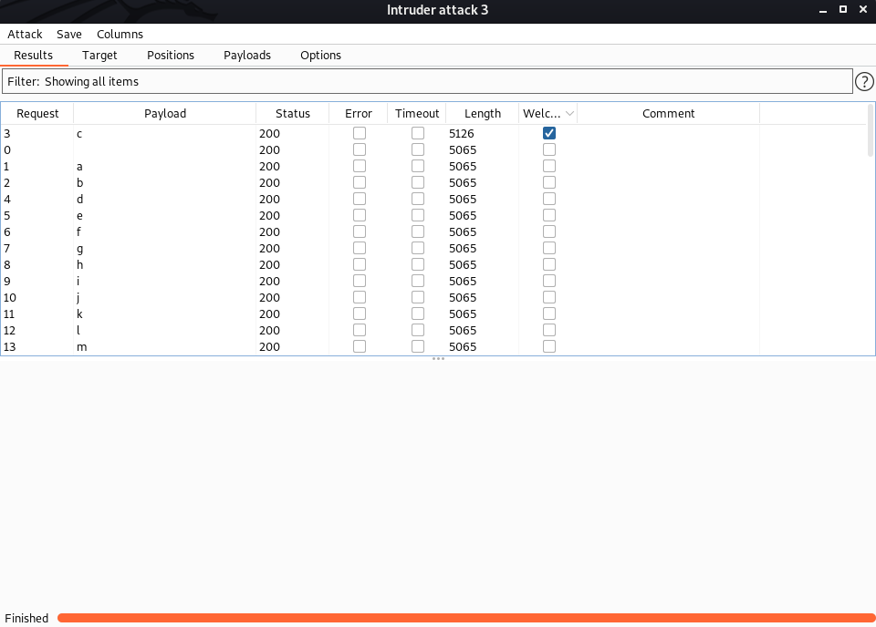
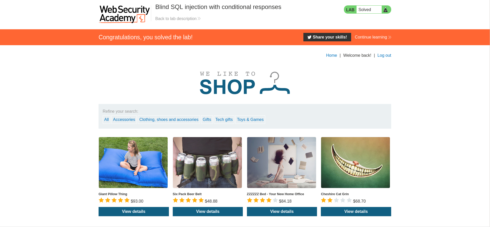

# Blind SQL Injection With Conditional Responses

**Level** Practitioner

> This lab contains a blind SQL injection vulnerability. The application uses a tracking cookie for analytics, and performs an SQL query containing the value of the submitted cookie.
> The results of the SQL query are not returned, and no error messages are displayed. But the application includes a "Welcome back" message in the page if the query returns any rows.
> The database contains a different table called users, with columns called username and password. You need to exploit the blind SQL injection vulnerability to find out the password of the administrator user.
> To solve the lab, log in as the administrator user. 

# Writeup

After turning on Burpsuite and intercepting a request, we notice that there is a TrackingId and session id.

Then, we can send the request to Repeater to try out differnet SQL attacks.

Firstly, we can try selecting username and password from the table users to check if the user administrator exists.

Weird.. it seems that there is no matches. How about instead of username and password, we put NULL?

Nice! We got the reply "Welcome back!". This means that the administrator username does exist.

Now, we have to find the length of the password by sending the request to Intruder.

Then, we will set the payload settings as such and start the attack.

After launching the attack, we find that request 20 had a different length response. This indicates that the password length is 20 characters long.

Now, we have to find the exact password for the administrator. We can use the SUBSTRING parameter to do so. 

Then, we set the payload settings to the following.

Then, we add the following response to the Intruder options and start the attack.

Yay! We got the first character of the password which is 'c'.

Now, we will have to do this iteratively for 20 times total by editing the SUBSTRING parameters to (password, x, 1) where x is the position of the character in the password.

Afterwards, we find out that the password is cz8my1hujx7hifw0bv7p

Use the password and login to the administrator account and you're done!
